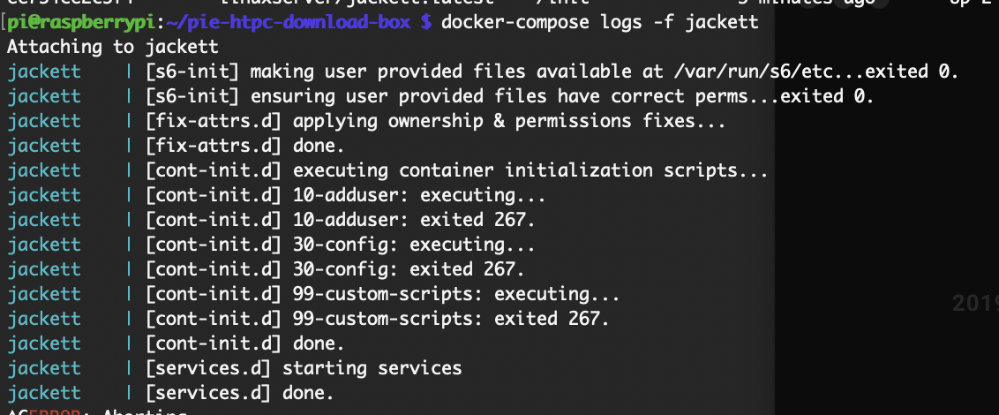
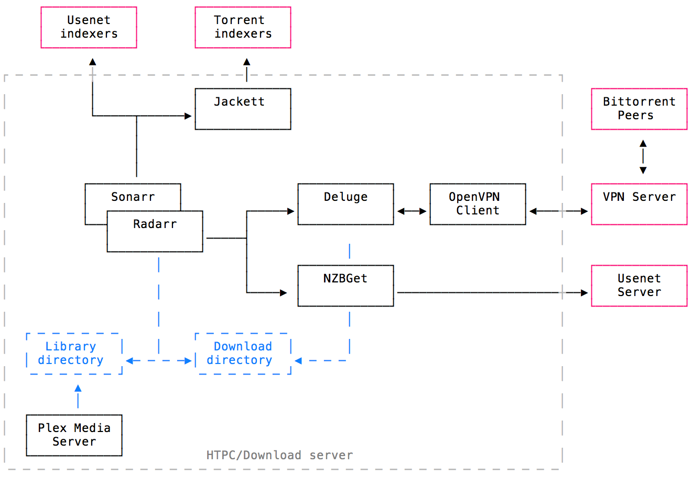

# Pie HTPC Download Box

Sonarr / Radarr / Jackett / NZBGet / Transmission / NordVPN / Plex

TV shows and movies download, sort, with the desired quality and subtitles, behind a VPN (optional), ready to watch, in a beautiful media player.
All automated.

## Table of Contents

- [HTPC Download Box](#htpc-download-box)
  - [Table of Contents](#table-of-contents)
  - [Overview](#overview)
    - [Monitor TV shows/movies with Sonarr and Radarr](#monitor-tv-showsmovies-with-sonarr-and-radarr)
    - [Search for releases automatically with Usenet and torrent indexers](#search-for-releases-automatically-with-usenet-and-torrent-indexers)
    - [Handle bittorrent and usenet downloads with Deluge and NZBGet](#handle-bittorrent-and-usenet-downloads-with-deluge-and-nzbget)
    - [Organize libraries, fetch subtitles and play videos with Plex](#organize-libraries-fetch-subtitles-and-play-videos-with-plex)
  - [Hardware configuration](#hardware-configuration)
  - [Software stack](#software-stack)
  - [Installation guide](#installation-guide)
    - [Introduction](#introduction)
    - [Install docker and docker-compose](#install-docker-and-docker-compose)
    - [Setup Transmission](#setup-transmission)
      - [Docker container](#docker-container)
      - [Configuration](#configuration)
    - [Setup a VPN Container](#setup-a-vpn-container)
      - [Introduction](#introduction)
      - [privateinternetaccess.com custom setup](#privateinternetaccesscom-custom-setup)
      - [Docker container](#docker-container)
    - [Setup Jackett](#setup-jackett)
    - [Setup NZBGet](#setup-nzbget)
    - [Setup Plex](#setup-plex)
    - [Setup Sonarr](#setup-sonarr)
    - [Setup Radarr](#setup-radarr)
    - [Reduce Pi Power Consumption](#reduce-pi-power-consumption)
      - [Disable HDMI](#disable-hdmi)
      - [Turn Off LEDs](#turn-off-leds)
      - [Disable Wifi](#disable-wifi)
      - [Disable Bluetooth](#disable-bluetooth)
  - [Manage it all from your mobile](#manage-it-all-from-your-mobile)
  - [Going Further](#going-further)

## Overview

[See original instructions](https://github.com/sebgl/htpc-download-box#overview)

## Hardware configuration

I have a Synology DS2013j but it's too old to run sonarr/jackett/radarr/plex properly. The movies and tvshows will be stored in a NTFS folder on my nas, the softwares configurations will be stored in the PI. SQLlite doesn't like to be in a network folder, give a lot of `database locked` errors.

I use a Pi 3B but I have added the instructions for older Pi like the 1B and tested it but wasn't able to make it work.



## Software stack



**Downloaders**:

- [Transmission](https://transmissionbt.com/): torrent downloader with a web UI
- [NZBGet](https://nzbget.net): usenet downloader with a web UI
- [Jackett](https://github.com/Jackett/Jackett): API to search torrents from multiple indexers

**Download orchestration**:

- [Sonarr](https://sonarr.tv): manage TV show, automatic downloads, sort & rename
- [Radarr](https://radarr.video): basically the same as Sonarr, but for movies

**VPN**:

- [NordVPN](https://nordvpn.com)

**Media Center**:

- [Plex](https://plex.tv): media center server with streaming transcoding features, useful plugins and a beautiful UI. Clients available for a lot of systems (Linux/OSX/Windows, Web, Android, Chromecast, Android TV, etc.)
- [Sub-Zero](https://github.com/pannal/Sub-Zero.bundle): subtitle auto-download channel for Plex

## Installation guide

### Introduction

The idea is to set up all these components as Docker containers in a `docker-compose.yml` file.
We'll reuse community-maintained images (special thanks to [linuxserver.io](https://www.linuxserver.io/) for many of them).
I'm assuming you have some basic knowledge of Linux and Docker.
A general-purpose `docker-compose` file is maintained in this repo [here](https://github.com/sebgl/htpc-download-box/blob/master/docker-compose.yml).

The stack is not really plug-and-play. You'll see that manual human configuration is required for most of these tools. Configuration is not fully automated (yet?), but is persisted on reboot. Some steps also depend on external accounts that you need to set up yourself (usenet indexers, torrent indexers, vpn server, plex account, etc.). We'll walk through it.

Optional steps described below that you may wish to skip:

- Using a VPN server for Transmission incoming/outgoing traffic.
- Using newsgroups (Usenet): you can skip NZBGet installation and all related Sonarr/Radarr indexers configuration if you wish to use bittorrent only.

### Install docker and docker-compose

```
sudo apt update
# install docker
curl -fsSL get.docker.com -o get-docker.sh && sh get-docker.sh
# For old Pi like B+ (v1.2) you need to downgrade docker version
# there is probably a more direct and better way to do it but didn't look for it
# sudo apt install docker-ce=18.06.2~ce~3-0~raspbian
sudo groupadd docker
sudo gpasswd -a $USER docker
newgrp docker
# install docker-compose
sudo apt install -y libffi6 libffi-dev
# For newer Pi like 3B
sudo apt install -y python python-pip
sudo pip install docker-compose # take a long time to run
# For older Pi like 1B+
sudo apt install docker-compose
```

Docker-compose on 1B+ only support version 2 of `docker-compose.yml`, just change the version on top of the `docker-compose.yml` file and it should works (Nope need some investigations).
More infos:

[Docker](https://github.com/moby/moby/issues/38175)

[Docker Compose](https://withblue.ink/2017/12/31/yes-you-can-run-docker-on-raspbian.html)

### (optional) Use premade docker-compose

This tutorial will guide you along the full process of making your own docker-compose file and configuring every app within it, however, to prevent errors or to reduce your typing, you can also use the general-purpose docker-compose file provided in this repository.

1. First, `https://github.com/marchah/pie-htpc-download-box` into a directory. This is where you will run the full setup from (note: this isn't the same as your media directory)
2. Rename the `.env.example` file included in the repo to `.env`.
3. Continue this guide, and the docker-compose file snippets you see are already ready for you to use. You'll still need to manually configure your `.env` file and other manual configurations.

### Setup environment variables

For each of these images, there is some unique coniguration that needs to be done. Instead of editing the docker-compose file to hardcode these values in, we'll instead put these values in a .env file. A .env file is a file for storing environment variables that can later be accessed in a general-purpose docker-compose.yml file, like the example one in this repository.

Here is an example of what your `.env` file should look like, use values that fit for your own setup.

https://github.com/bubuntux/nordvpn#local-network-access-to-services-connecting-to-the-internet-through-the-vpn

```sh
# Your timezone, https://en.wikipedia.org/wiki/List_of_tz_database_time_zones
TZ=America/Los_Angeles
# UNIX PUID and PGID, find with: id $USER
PUID=1000
PGID=1000
# Local network mask, find with: ip route | awk '!/ (docker0|br-)/ && /src/ {print $1}'
NETWORK=192.168.0.0/24
# The directory where downloading torrent and configuration will be stored.
ROOT=/media/my_user/storage/htpc
# The directory where movies and tvshows will be stored. usually network shared folder
PLEX=/media/my_user/storage/homemedia
#NordVPN informations
VPN_USER=usero@email.com
VPN_PASSWORD=password
VPN_COUNTRY=CA
```

Things to notice:

- TZ is based on your [tz time zone](https://en.wikipedia.org/wiki/List_of_tz_database_time_zones).
- The PUID and PGID are your user's ids. Find them with `id $USER`.
- This file should be in the same directory as your `docker-compose.yml` file so the values can be read in.
- You local network mask to make transmission accessible in your local network, [more infos](https://github.com/bubuntux/nordvpn#local-network-access-to-services-connecting-to-the-internet-through-the-vpn)
- Your NordVPN password/login and VPN server country

### Setup Transmission

#### Docker container

We'll use transmission Docker image from linuxserver, which runs both the transmission daemon and web UI in a single container.

```yaml
transmission:
  image: linuxserver/transmission:latest
  container_name: transmission
  restart: unless-stopped
  network_mode: service:vpn # run on the vpn network
  environment:
    - PUID=${PUID} # default user id, defined in .env
    - PGID=${PGID} # default group id, defined in .env
    - TZ=${TZ} # timezone, defined in .env
  volumes:
    - ${ROOT}/downloads:/downloads # downloads folder
    - ${ROOT}/config/transmission:/config # config files
```

Things to notice:

- I use the host network to simplify configuration. Important ports are `9091` (web UI) and `51413` (bittorrent daemon).

Then run the container with `docker-compose up -d`.
To follow container logs, run `docker-compose logs -f transmission`.

#### Configuration

_instruction not updated for transmission but should be pretty much the same_

You should be able to login on the web UI (`localhost:9091`, replace `localhost` by your machine ip if needed).

The default password is `admin`. You are asked to modify it, I chose to set an empty one since transmission won't be accessible from outside my local network.

The running deluge daemon should be automatically detected and appear as online, you can connect to it.

You may want to change the download directory. I like to have to distinct directories for incomplete (ongoing) downloads, and complete (finished) ones.
Also, I set up a blackhole directory: every torrent file in there will be downloaded automatically. This is useful for Jackett manual searches.

You should activate `autoadd` in the plugins section: it adds supports for `.magnet` files.

You can also tweak queue settings, defaults are fairly small. Also you can decide to stop seeding after a certain ratio is reached. That will be useful for Sonarr, since Sonarr can only remove finished downloads from deluge when the torrent has stopped seeding. Setting a very low ratio is not very fair though !

Configuration gets stored automatically in your mounted volume (`${ROOT}/config/transmission`) to be re-used at container restart. Important files in there:

- `auth` contains your login/password
- `core.conf` contains your deluge configuration

You can use the Web UI manually to download any torrent from a .torrent file or magnet hash.

You should also add a [blacklist](https://giuliomac.wordpress.com/2014/02/19/best-blocklist-for-transmission/) for extra protection

### Setup a VPN Container

#### Introduction

The goal here is to have an NordVPN Client container running and always connected. We'll make Transmission incoming and outgoing traffic go through this NordVPN container.

This must come up with some safety features:

1. VPN connection should be restarted if not responsive
1. Traffic should be allowed through the VPN tunnel _only_, no leaky outgoing connection if the VPN is down
1. Transmission Web UI should still be reachable from the local network

#### Docker container

Put it in the docker-compose file, and make transmission use the vpn container network:

```yaml
vpn:
  container_name: vpn
  image: bubuntux/nordvpn:latest
  cap_add:
    - net_admin # required to modify network interfaces
  restart: unless-stopped
  devices:
    - /dev/net/tun
  environment:
    - USER=${VPN_USER} # vpn user, defined in .env
    - PASS=${VPN_PASSWORD} # vpn password, defined in .env
    - COUNTRY=${VPN_COUNTRY} # vpn country, defined in .env
    - NETWORK=${NETWORK} # local network mask, defined in .env
    - PROTOCOL=UDP
    - CATEGORY=P2P
    - OPENVPN_OPTS=--pull-filter ignore "ping-restart" --ping-exit 180
    - TZ=${TZ} # timezone, defined in .env
  ports:
    - 9091:9091 # Transmission web UI
    - 51413:51413 # Transmission bittorrent daemon
    - 51413:51413/udp # Transmission bittorrent daemon

transmission:
  image: linuxserver/transmission:latest
  container_name: transmission
  restart: unless-stopped
  network_mode: service:vpn # run on the vpn network
  environment:
    - PUID=${PUID} # default user id, defined in .env
    - PGID=${PGID} # default group id, defined in .env
    - TZ=${TZ} # timezone, defined in .env
  volumes:
    - ${ROOT}/downloads:/downloads # downloads folder
    - ${ROOT}/config/transmission:/config # config files
```

Notice how transmission is now using the vpn container network, with transmission web UI port exposed on the vpn container for local network access.

You can check that transmission is properly going out through the VPN IP by using [torguard check](https://torguard.net/checkmytorrentipaddress.php).
Get the torrent magnet link there, put it in Transmission, wait a bit, then you should see your outgoing torrent IP on the website.


### Setup Jackett

[See original instructions](https://github.com/sebgl/htpc-download-box#setup-jackett)

### Setup NZBGet

Uncomment container instructions in `docker.compose.yml`

[See original instructions](https://github.com/sebgl/htpc-download-box#setup-nzbget)

### Setup Plex

[See original instructions](https://github.com/sebgl/htpc-download-box#setup-plex)

### Setup Sonarr

[See original instructions](https://github.com/sebgl/htpc-download-box#setup-sonarr)

### Setup Radarr

[See original instructions](https://github.com/sebgl/htpc-download-box#setup-radarr)

## Reduce Pi Power Consumption

### Disable HDMI

1. Run `/usr/bin/tvservice -o`
1. Add `/usr/bin/tvservice -o` in `/etc/rc.local` to disable HDMI on boot

### Turn Off LEDs

```
# The line below is used to turn off the power LED
sudo sh -c 'echo 0 > /sys/class/leds/led1/brightness'

# The line below is used to turn off the action LED
sudo sh -c 'echo 0 > /sys/class/leds/led0/brightness'
```

Add the following to the `/boot/config.txt`

```
# Disable Ethernet LEDs
dtparam=eth_led0=14
dtparam=eth_led1=14

# Disable the PWR LED
dtparam=pwr_led_trigger=none
dtparam=pwr_led_activelow=off

# Disable the Activity LED
dtparam=act_led_trigger=none
dtparam=act_led_activelow=off
```

### Disable Wifi

Add the following to the `/boot/config.txt`

```
# Disable Wifi
dtoverlay=pi3-disable-wifi
```

### Disable Bluetooth

Add the following to the `/boot/config.txt`

```
# Disable Bluetooth
dtoverlay=pi3-disable-bt
```

## Manage it all from your mobile

[See original instructions](https://github.com/sebgl/htpc-download-box#manage-it-all-from-your-mobile)

## Going Further

[See original instructions](https://github.com/sebgl/htpc-download-box#going-further)
