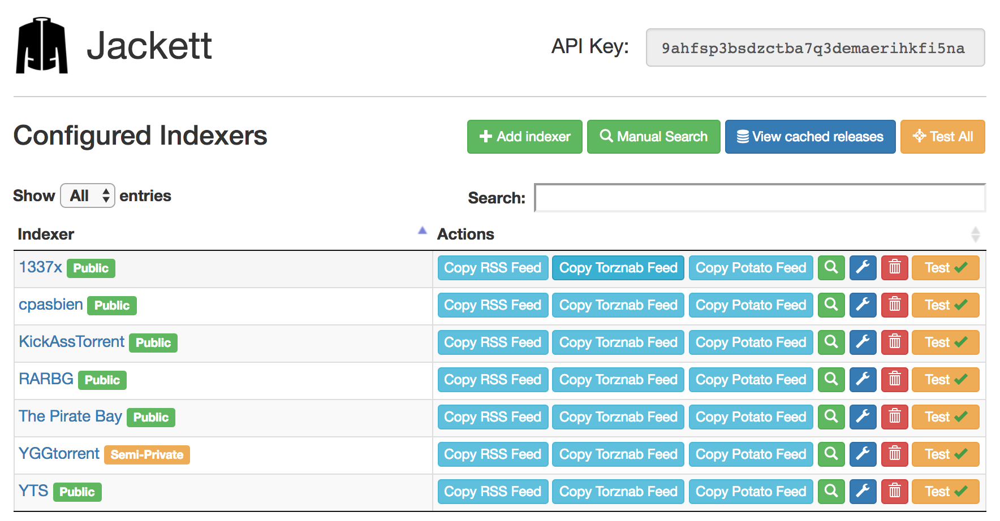
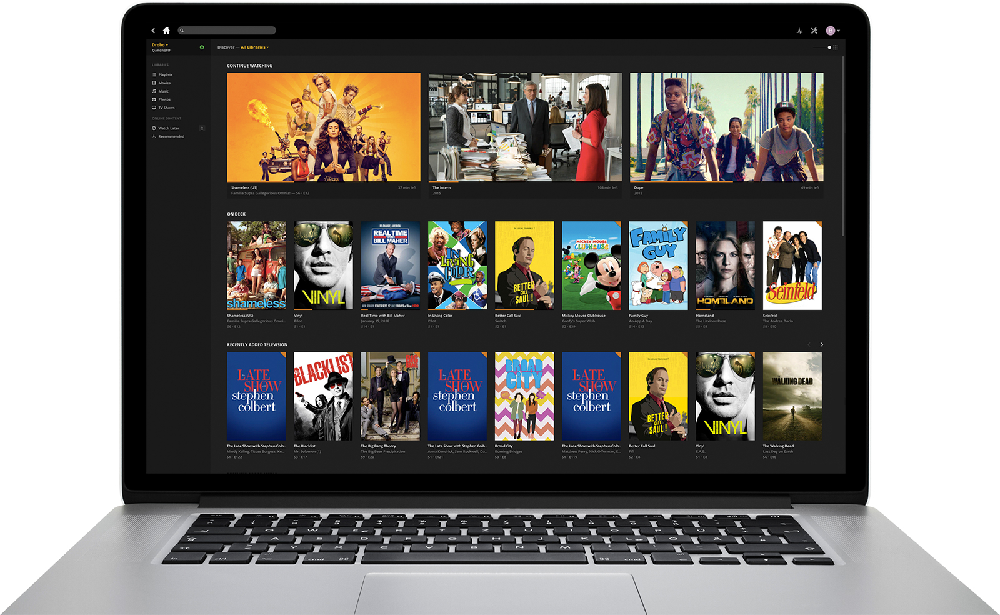
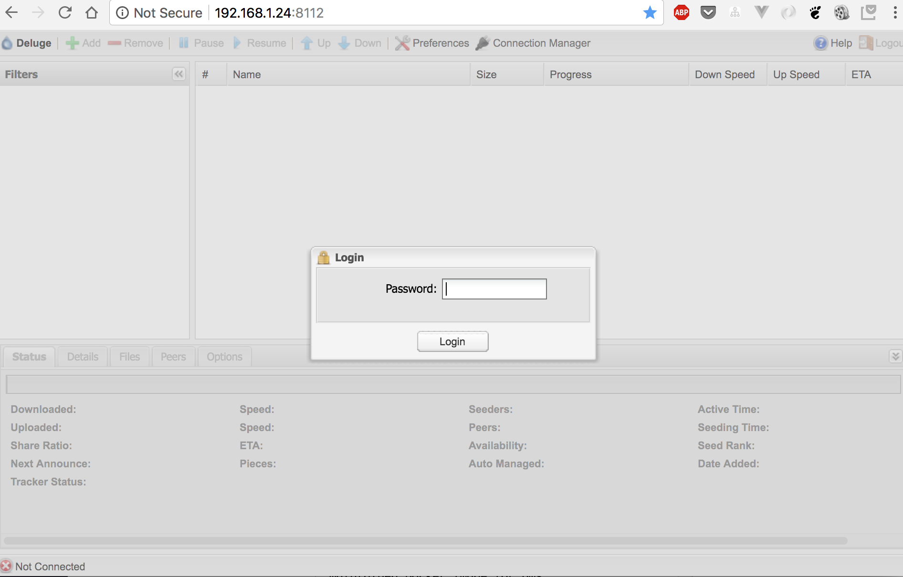
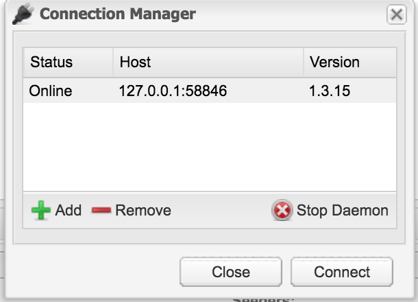
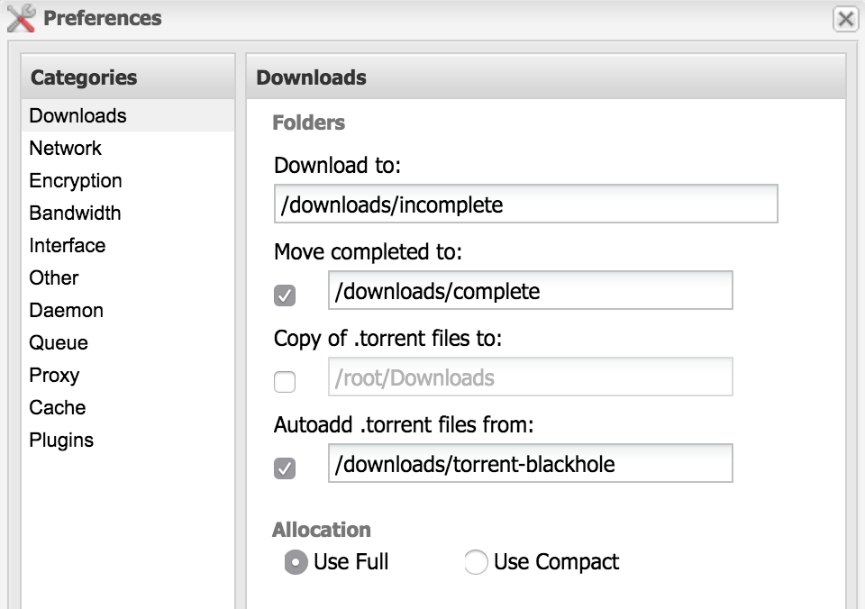

# Pie HTPC Download Box

## **WIP**

- Wasn't able to access transmission Web UI

<br>
<br>

Sonarr / Radarr / Jackett / NZBGet / Transmission / NordVPN / Plex

TV shows and movies download, sort, with the desired quality and subtitles, behind a VPN (optional), ready to watch, in a beautiful media player.
All automated.

## Table of Contents

- [HTPC Download Box](#htpc-download-box)
  - [Table of Contents](#table-of-contents)
  - [Overview](#overview)
    - [Monitor TV shows/movies with Sonarr and Radarr](#monitor-tv-showsmovies-with-sonarr-and-radarr)
    - [Search for releases automatically with Usenet and torrent indexers](#search-for-releases-automatically-with-usenet-and-torrent-indexers)
    - [Handle bittorrent and usenet downloads with Deluge and NZBGet](#handle-bittorrent-and-usenet-downloads-with-deluge-and-nzbget)
    - [Organize libraries, fetch subtitles and play videos with Plex](#organize-libraries-fetch-subtitles-and-play-videos-with-plex)
  - [Hardware configuration](#hardware-configuration)
  - [Software stack](#software-stack)
  - [Installation guide](#installation-guide)
    - [Introduction](#introduction)
    - [Install docker and docker-compose](#install-docker-and-docker-compose)
    - [Setup Transmission](#setup-transmission)
      - [Docker container](#docker-container)
      - [Configuration](#configuration)
    - [Setup a VPN Container](#setup-a-vpn-container)
      - [Introduction](#introduction)
      - [privateinternetaccess.com custom setup](#privateinternetaccesscom-custom-setup)
      - [Docker container](#docker-container)
    - [Setup Jackett](#setup-jackett)
      - [Docker container](#docker-container)
      - [Configuration and usage](#configuration-and-usage)
    - [Setup NZBGet](#setup-nzbget)
      - [Docker container](#docker-container)
      - [Configuration and usage](#configuration-and-usage)
    - [Setup Plex](#setup-plex)
      - [Media Server Docker Container](#media-server-docker-container)
      - [Configuration](#configuration)
      - [Download subtitles automatically with sub-zero](#download-subtitles-automatically-with-sub-zero)
      - [Setup Plex clients](#setup-plex-clients)
    - [Setup Sonarr](#setup-sonarr)
      - [Docker container](#docker-container)
      - [Configuration](#configuration)
      - [Give it a try](#give-it-a-try)
    - [Setup Radarr](#setup-radarr)
      - [Docker container](#docker-container)
      - [Configuration](#configuration)
      - [Give it a try](#give-it-a-try)
      - [Movie discovering](#movie-discovering)
  - [Manage it all from your mobile](#manage-it-all-from-your-mobile)
  - [Going Further](#going-further)

## Overview

This is what I have set up at home to handle TV shows and movies automated download, sort and play.

_Disclaimer: I'm not encouraging/supporting piracy, this is for information purpose only._

How does it work? I rely on several tools integrated together. They're all open-source, and deployed as Docker containers on my Linux server.

The common workflow is detailed in this first section to give you an idea of how things work.

### Monitor TV shows/movies with Sonarr and Radarr

Using [Sonarr](https://sonarr.tv/) Web UI, search for a TV show by name and mark it as monitored. You can specify a language and the required quality (1080p for instance). Sonarr will automatically take care of analyzing existing episodes and seasons of this TV show. It compares what you have on disk with the TV show release schedule, and triggers download for missing episodes. It also takes care of upgrading your existing episodes if a better quality matching your criterias is available out there.


Sonarr triggers download batches for entire seasons. But it also handle upcoming episodes and seasons on-the-fly. No human intervention is required for all the episodes to be released from now on.

When the download is over, Sonarr moves the file to the appropriate location (`my-tv-shows/show-name/season-1/01-title.mp4`), and renames the file if needed.


[Radarr](https://radarr.video) is the exact same thing, but for movies.

### Search for releases automatically with Usenet and torrent indexers

Sonarr and Radarr can both rely on two different ways to download files:

- Usenet (newsgroups) bin files. That's the historical and principal option, for several reasons: consistency and quality of the releases, download speed, indexers organization, etc. Often requires a paid subscription to newsgroup servers.
- Torrents. That's the new player in town, for which support has improved a lot lately.

I'm using both systems simultaneously, torrents being used only when a release is not found on newsgroups, or when the server is down. At some point I might switch to torrents only, which work really fine as well.

Files are searched automatically by Sonarr/Radarr through a list of _indexers_ that you have to configure. Indexers are APIs that allow searching for particular releases organized by categories. Think browsing the Pirate Bay programmatically. This is a pretty common feature for newsgroups indexers that respect a common API (called `Newznab`).
However this common protocol does not really exist for torrent indexers. That's why we'll be using another tool called [Jackett](https://github.com/Jackett/Jackett). You can consider it as a local proxy API for the most popular torrent indexers. It searches and parse information from heterogeneous websites.



The best release matching your criteria is selected by Sonarr/Radarr (eg. non-blacklisted 1080p release with enough seeds). Then the download is passed on to another set of tools.

### Handle bittorrent and usenet downloads with Deluge and NZBGet

Sonarr and Radarr are plugged to downloaders for our 2 different systems:

- [NZBGet](https://nzbget.net/) handles Usenet (newsgroups) binary downloads.
- [Transmission](https://transmissionbt.com/) handles torrent download.

Both are daemons coming with a nice Web UI, making them perfect candidates for being installed on a server. Sonarr & Radarr already have integration with them, meaning they rely on each service API to pass on downloads, request download status and handle finished downloads.

Both are very standard and popular tools. I'm using them for their integration with Sonarr/Radarr but also as standalone downloaders for everything else.

For security and anonymity reasons, I'm running Transmission behind a VPN connection. All incoming/outgoing traffic from deluge is encrypted and goes out to an external VPN server. Other service stay on my local network. This is done through Docker networking stack (more to come on the next paragraphs).

### Organize libraries, fetch subtitles and play videos with Plex

[Plex](https://www.plex.tv/) Media Server organize all your medias as libraries. You can set up one for TV shows and another one for movies.
It automatically grabs metadata for each new release (description, actors, images, release date). A very nice feature that we'll use a lot is the [sub-zero plugin](https://github.com/pannal/Sub-Zero.bundle). Whenever a new video arrives in Plex library, sub-zero automatically searches and downloads the most appropriate subtitle from a list of subtitle providers, based on several criterias (release name, quality, popularity, etc).



Plex keeps track of your position in the entire library: what episode of a given TV show season you've watched, what movie you've not watched yet, what episode was added to the library since last time. It also remembers where you stopped within a video file. Basically you can pause a movie in your bedroom, then resume playback from another device in your bathroom.

Plex comes with [clients](https://www.plex.tv/apps/) in a lot of different systems (Web UI, Linux, Windows, OSX, iOS, Android, Android TV, Chromecast, PS4, Smart TV, etc.) that allow you to display and watch all your shows/movies in a nice Netflix-like UI.

The server has transcoding abilities: it automatically transcodes video quality if needed (eg. stream your 1080p movie in 480p if watched from a mobile with low bandwidth).

## Hardware configuration

I'm using an old [Proliant MicroServer N54L](http://www.minimachines.net/promos-et-sorties/bon-plan-un-micro-serveur-hp-proliant-4-emplacements-a-169e-371) (2 cores, 2.20GHz) that I tweaked a bit to have 6GB RAM, an additional graphic card for better Full HD decoding, and an additional 2TB disk for data.

It has Ubuntu 17.10.1 with Docker installed.

You can also use a Raspberry Pi, a Synology NAS, a Windows or Mac computer. The stack should work fine on all these systems, but you'll have to adapt the Docker stack below to your OS. I'll only focus on a standard Linux installation here.

## Software stack


**Downloaders**:

- [Deluge](http://deluge-torrent.org): torrent downloader with a web UI
- [NZBGet](https://nzbget.net): usenet downloader with a web UI
- [Jackett](https://github.com/Jackett/Jackett): API to search torrents from multiple indexers

**Download orchestration**:

- [Sonarr](https://sonarr.tv): manage TV show, automatic downloads, sort & rename
- [Radarr](https://radarr.video): basically the same as Sonarr, but for movies

**VPN**:

- [NordVPN](https://nordvpn.com)

**Media Center**:

- [Plex](https://plex.tv): media center server with streaming transcoding features, useful plugins and a beautiful UI. Clients available for a lot of systems (Linux/OSX/Windows, Web, Android, Chromecast, Android TV, etc.)
- [Sub-Zero](https://github.com/pannal/Sub-Zero.bundle): subtitle auto-download channel for Plex

## Installation guide

### Introduction

The idea is to set up all these components as Docker containers in a `docker-compose.yml` file.
We'll reuse community-maintained images (special thanks to [linuxserver.io](https://www.linuxserver.io/) for many of them).
I'm assuming you have some basic knowledge of Linux and Docker.
A general-purpose `docker-compose` file is maintained in this repo [here](https://github.com/sebgl/htpc-download-box/blob/master/docker-compose.yml).

The stack is not really plug-and-play. You'll see that manual human configuration is required for most of these tools. Configuration is not fully automated (yet?), but is persisted on reboot. Some steps also depend on external accounts that you need to set up yourself (usenet indexers, torrent indexers, vpn server, plex account, etc.). We'll walk through it.

Optional steps described below that you may wish to skip:

- Using a VPN server for Transmission incoming/outgoing traffic.
- Using newsgroups (Usenet): you can skip NZBGet installation and all related Sonarr/Radarr indexers configuration if you wish to use bittorrent only.

### Install docker and docker-compose

```
sudo apt update
# install docker
curl -fsSL get.docker.com -o get-docker.sh && sh get-docker.sh
sudo groupadd docker
sudo gpasswd -a $USER docker
newgrp docker
# install docker-compose
sudo apt install -y python python-pip
sudo apt install libffi6 libffi-dev
sudo pip install docker-compose
```

### (optional) Use premade docker-compose

This tutorial will guide you along the full process of making your own docker-compose file and configuring every app within it, however, to prevent errors or to reduce your typing, you can also use the general-purpose docker-compose file provided in this repository.

1. First, `https://github.com/marchah/pie-htpc-download-box` into a directory. This is where you will run the full setup from (note: this isn't the same as your media directory)
2. Rename the `.env.example` file included in the repo to `.env`.
3. Continue this guide, and the docker-compose file snippets you see are already ready for you to use. You'll still need to manually configure your `.env` file and other manual configurations.

### Setup environment variables

For each of these images, there is some unique coniguration that needs to be done. Instead of editing the docker-compose file to hardcode these values in, we'll instead put these values in a .env file. A .env file is a file for storing environment variables that can later be accessed in a general-purpose docker-compose.yml file, like the example one in this repository.

Here is an example of what your `.env` file should look like, use values that fit for your own setup.

```sh
# Your timezone, https://en.wikipedia.org/wiki/List_of_tz_database_time_zones
TZ=America/New_York
PUID=1000
PGID=1000
# The directory where data and configuration will be stored.
ROOT=/media/my_user/storage/homemedia
```

Things to notice:

- TZ is based on your [tz time zone](https://en.wikipedia.org/wiki/List_of_tz_database_time_zones).
- The PUID and PGID are your user's ids. Find them with `id $USER`.
- This file should be in the same directory as your `docker-compose.yml` file so the values can be read in.

### Setup Transmission

#### Docker container

We'll use transmission Docker image from linuxserver, which runs both the transmission daemon and web UI in a single container.

```yaml
version: "3"
services:
  transmission:
  image: linuxserver/transmission:latest
  container_name: transmission
  restart: unless-stopped
  network_mode: service:vpn # run on the vpn network
  environment:
    - PUID=${PUID} # default user id, defined in .env
    - PGID=${PGID} # default group id, defined in .env
    - TZ=${TZ} # timezone, defined in .env
  volumes:
    - ${ROOT}/downloads:/downloads # downloads folder
    - ${ROOT}/config/transmission:/config # config files
```

Things to notice:

- I use the host network to simplify configuration. Important ports are `9091` (web UI) and `51413` (bittorrent daemon).

Then run the container with `docker-compose up -d`.
To follow container logs, run `docker-compose logs -f transmission`.

#### Configuration

You should be able to login on the web UI (`localhost:9091`, replace `localhost` by your machine ip if needed).



The default password is `deluge`. You are asked to modify it, I chose to set an empty one since deluge won't be accessible from outside my local network.

The running deluge daemon should be automatically detected and appear as online, you can connect to it.



You may want to change the download directory. I like to have to distinct directories for incomplete (ongoing) downloads, and complete (finished) ones.
Also, I set up a blackhole directory: every torrent file in there will be downloaded automatically. This is useful for Jackett manual searches.

You should activate `autoadd` in the plugins section: it adds supports for `.magnet` files.



You can also tweak queue settings, defaults are fairly small. Also you can decide to stop seeding after a certain ratio is reached. That will be useful for Sonarr, since Sonarr can only remove finished downloads from deluge when the torrent has stopped seeding. Setting a very low ratio is not very fair though !

Configuration gets stored automatically in your mounted volume (`${ROOT}/config/deluge`) to be re-used at container restart. Important files in there:

- `auth` contains your login/password
- `core.conf` contains your deluge configuration

You can use the Web UI manually to download any torrent from a .torrent file or magnet hash.

### Setup a VPN Container

#### Introduction

The goal here is to have an NordVPN Client container running and always connected. We'll make Transmission incoming and outgoing traffic go through this NordVPN container.

This must come up with some safety features:

1. VPN connection should be restarted if not responsive
1. Traffic should be allowed through the VPN tunnel _only_, no leaky outgoing connection if the VPN is down
1. Transmission Web UI should still be reachable from the local network

#### Docker container

Put it in the docker-compose file, and make transmission use the vpn container network:

```yaml
vpn:
  container_name: vpn
  image: bubuntux/nordvpn:latest
  cap_add:
    - net_admin # required to modify network interfaces
  restart: unless-stopped
  devices:
    - /dev/net/tun
  environment:
    - USER=${VPN_USER} # vpn user, defined in .env
    - PASS=${VPN_PASSWORD} # vpn password, defined in .env
    - COUNTRY=${VPN_COUNTRY} # vpn country, defined in .env
    - PROTOCOL=UDP
    - CATEGORY=P2P
    - OPENVPN_OPTS=--pull-filter ignore "ping-restart" --ping-exit 180
    - TZ=${TZ} # timezone, defined in .env
  ports:
    - 9091:9091 # Transmission web UI
    - 51413:51413 # Transmission bittorrent daemon
    - 51413:51413/udp # Transmission bittorrent daemon

transmission:
  image: linuxserver/transmission:latest
  container_name: transmission
  restart: unless-stopped
  network_mode: service:vpn # run on the vpn network
  environment:
    - PUID=${PUID} # default user id, defined in .env
    - PGID=${PGID} # default group id, defined in .env
    - TZ=${TZ} # timezone, defined in .env
  volumes:
    - ${ROOT}/downloads:/downloads # downloads folder
    - ${ROOT}/config/transmission:/config # config files
```

Notice how transmission is now using the vpn container network, with transmission web UI port exposed on the vpn container for local network access.

You can check that transmission is properly going out through the VPN IP by using [torguard check](https://torguard.net/checkmytorrentipaddress.php).
Get the torrent magnet link there, put it in Transmission, wait a bit, then you should see your outgoing torrent IP on the website.


### Setup Jackett

[See original instructions](https://github.com/sebgl/htpc-download-box#setup-jackett)

### Setup NZBGet

[See original instructions](https://github.com/sebgl/htpc-download-box#setup-nzbget)

### Setup Plex

[See original instructions](https://github.com/sebgl/htpc-download-box#setup-plex)

### Setup Sonarr

[See original instructions](https://github.com/sebgl/htpc-download-box#setup-sonarr)

### Setup Radarr

[See original instructions](https://github.com/sebgl/htpc-download-box#setup-radarr)

## Manage it all from your mobile

[See original instructions](https://github.com/sebgl/htpc-download-box#manage-it-all-from-your-mobile)

## Going Further

[See original instructions](https://github.com/sebgl/htpc-download-box#going-further)
