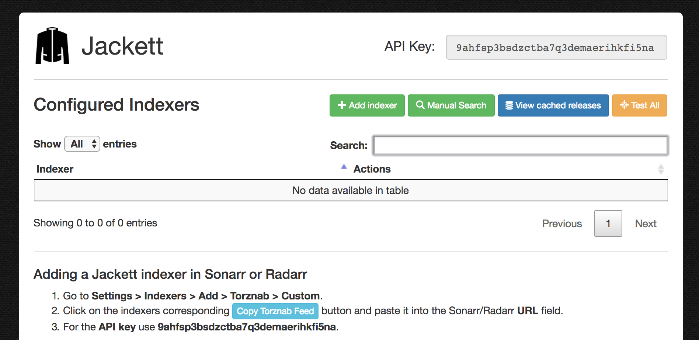

# Setup Jackett

[Jackett](https://github.com/Jackett/Jackett) translates request from Sonarr and Radarr to searches for torrents on popular torrent websites, even though those website do not have a sandard common APIs (to be clear: it parses html for many of them :)).

## Docker container

No surprise: let's use linuxserver.io container !

```yaml
jackett:
  container_name: jackett
  image: linuxserver/jackett:latest
  restart: unless-stopped
  ports:
    - 9117:9117
  environment:
    - PUID=${PUID} # default user id, defined in .env
    - PGID=${PGID} # default group id, defined in .env
    - TZ=${TZ} # timezone, defined in .env
  volumes:
    - /etc/localtime:/etc/localtime:ro
    - ${ROOT}/downloads/torrent-blackhole:/downloads # place where to put .torrent files for manual download
    - ${ROOT}/config/jackett:/config # config files
  labels:
    - 'traefik.backend=jackett'
    - 'traefik.local.frontend.rule=Host:jackett.localhost'
    - 'traefik.port=9117'
    - 'traefik.enable=true'
```

Nothing particular in this configuration, it's pretty similar to other linuxserver.io images.
An interesting setting is the torrent blackhole directory. When you do manual searches, Jackett will put `.torrent` files there, to be grabbed by your torrent client directly (Deluge for instance).

As usual, run with `docker-compose up -d`.

## Configuration and usage

Jackett web UI is available at `jackett.localhost`.



Configuration is available at the bottom of the page. I chose to disable auto-update (I'll rely on the docker images tags myself), and to set `/downloads` as my blackhole directory.

Click on `Add Indexer` and add any torrent indexer that you like. I added 1337x, cpasbien, RARBG, The Pirate Bay and YGGTorrent (need a user/password).

You can now perform a manual search across multiple torrent indexers in a clean interface with no trillion ads pop-up everywhere. Then choose to save the .torrent file to the configured blackhole directory, ready to be picked up by Deluge automatically !


