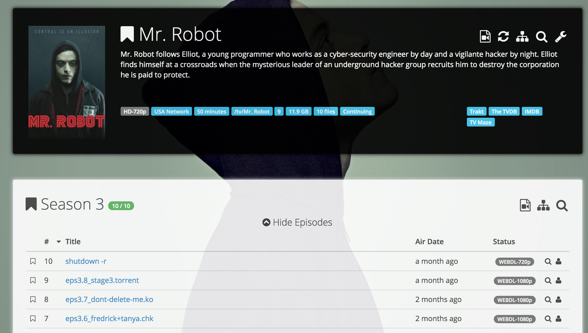
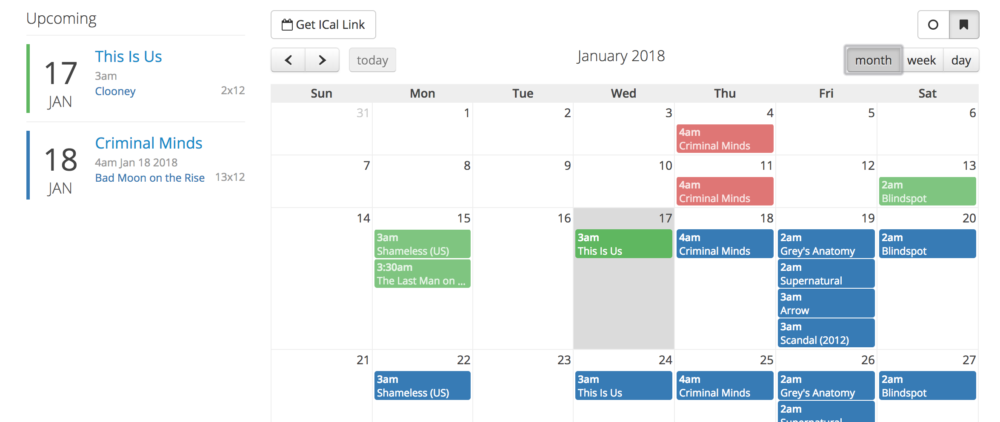

# Overview

This is what I have set up at home to handle TV shows and movies automated download, sort and play.

How does it work? I rely on several tools integrated together. They're all open-source, and deployed as Docker containers on my Linux server.

The common workflow is detailed in this first section to give you an idea of how things work.

### Monitor TV shows/movies with Sonarr and Radarr

Using [Sonarr](https://sonarr.tv/) Web UI, search for a TV show by name and mark it as monitored. You can specify a language and the required quality (1080p for instance). Sonarr will automatically take care of analyzing existing episodes and seasons of this TV show. It compares what you have on disk with the TV show release schedule, and triggers download for missing episodes. It also takes care of upgrading your existing episodes if a better quality matching your criterias is available out there.

Sonarr triggers download batches for entire seasons. But it also handle upcoming episodes and seasons on-the-fly. No human intervention is required for all the episodes to be released from now on.

When the download is over, Sonarr moves the file to the appropriate location (`my-tv-shows/show-name/season-1/01-title.mp4`), and renames the file if needed.

[Radarr](https://radarr.video) is the exact same thing, but for movies.

### Search for releases automatically with Usenet and torrent indexers

Sonarr and Radarr can both rely on two different ways to download files:

- Usenet (newsgroups) bin files. That's the historical and principal option, for several reasons: consistency and quality of the releases, download speed, indexers organization, etc. Often requires a paid subscription to newsgroup servers.
- Torrents. That's the new player in town, for which support has improved a lot lately.

I'm using both systems simultaneously, torrents being used only when a release is not found on newsgroups, or when the server is down. At some point I might switch to torrents only, which work really fine as well.

Files are searched automatically by Sonarr/Radarr through a list of _indexers_ that you have to configure. Indexers are APIs that allow searching for particular releases organized by categories. Think browsing the Pirate Bay programmatically. This is a pretty common feature for newsgroups indexers that respect a common API (called `Newznab`).
However this common protocol does not really exist for torrent indexers. That's why we'll be using another tool called [Jackett](https://github.com/Jackett/Jackett). You can consider it as a local proxy API for the most popular torrent indexers. It searches and parse information from heterogeneous websites.

The best release matching your criteria is selected by Sonarr/Radarr (eg. non-blacklisted 1080p release with enough seeds). Then the download is passed on to another set of tools.

### Handle bittorrent and usenet downloads with Deluge and NZBGet

Sonarr and Radarr are plugged to downloaders for our 2 different systems:

- [NZBGet](https://nzbget.net/) handles Usenet (newsgroups) binary downloads.
- [Deluge](http://deluge-torrent.org/) handles torrent download.

Both are daemons coming with a nice Web UI, making them perfect candidates for being installed on a server. Sonarr & Radarr already have integration with them, meaning they rely on each service API to pass on downloads, request download status and handle finished downloads.

Both are very standard and popular tools. I'm using them for their integration with Sonarr/Radarr but also as standalone downloaders for everything else.

For security and anonymity reasons, I'm running Deluge behind a VPN connection. All incoming/outgoing traffic from deluge is encrypted and goes out to an external VPN server. Other service stay on my local network. This is done through Docker networking stack (more to come on the next paragraphs).

### Organize libraries, fetch subtitles and play videos with Plex

[Plex](https://www.plex.tv/) Media Server organize all your medias as libraries. You can set up one for TV shows and another one for movies.
It automatically grabs metadata for each new release (description, actors, images, release date). A very nice feature that we'll use a lot is the [sub-zero plugin](https://github.com/pannal/Sub-Zero.bundle). Whenever a new video arrives in Plex library, sub-zero automatically searches and downloads the most appropriate subtitle from a list of subtitle providers, based on several criterias (release name, quality, popularity, etc).

Plex keeps track of your position in the entire library: what episode of a given TV show season you've watched, what movie you've not watched yet, what episode was added to the library since last time. It also remembers where you stopped within a video file. Basically you can pause a movie in your bedroom, then resume playback from another device in your bathroom.

Plex comes with [clients](https://www.plex.tv/apps/) in a lot of different systems (Web UI, Linux, Windows, OSX, iOS, Android, Android TV, Chromecast, PS4, Smart TV, etc.) that allow you to display and watch all your shows/movies in a nice Netflix-like UI.

The server has transcoding abilities: it automatically transcodes video quality if needed (eg. stream your 1080p movie in 480p if watched from a mobile with low bandwidth).

## Hardware configuration

I'm using an old [Proliant MicroServer N54L](http://www.minimachines.net/promos-et-sorties/bon-plan-un-micro-serveur-hp-proliant-4-emplacements-a-169e-371) (2 cores, 2.20GHz) that I tweaked a bit to have 6GB RAM, an additional graphic card for better Full HD decoding, and an additional 2TB disk for data.

It has Ubuntu 17.10.1 with Docker installed.

You can also use a Raspberry Pi, a Synology NAS, a Windows or Mac computer. The stack should work fine on all these systems, but you'll have to adapt the Docker stack below to your OS. I'll only focus on a standard Linux installation here.

## Software stack

**Downloaders**:

- [Deluge](http://deluge-torrent.org): torrent downloader with a web UI
- [NZBGet](https://nzbget.net): usenet downloader with a web UI
- [Jackett](https://github.com/Jackett/Jackett): API to search torrents from multiple indexers

**Download orchestration**:

- [Sonarr](https://sonarr.tv): manage TV show, automatic downloads, sort & rename
- [Radarr](https://radarr.video): basically the same as Sonarr, but for movies

**VPN**:

- [OpenVPN](https://openvpn.net/) client configured with a [privateinternetaccess.com](https://www.privateinternetaccess.com/) access

**Reverse Proxy**:

- [Traefik](https://traefik.io/) serves all of your services through a common host, allowing for remote HTTPS access with authentication.

**Media Center**:

- [Plex](https://plex.tv): media center server with streaming transcoding features, useful plugins and a beautiful UI. Clients available for a lot of systems (Linux/OSX/Windows, Web, Android, Chromecast, Android TV, etc.)
- [Sub-Zero](https://github.com/pannal/Sub-Zero.bundle): subtitle auto-download channel for Plex
