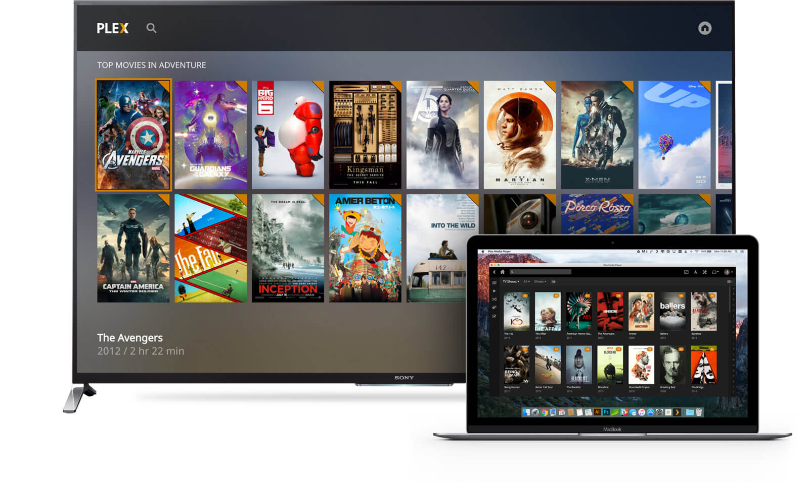

# Setup Plex

## Media Server Docker Container

Luckily for us, Plex team already provides a maintained [Docker image for pms](https://github.com/plexinc/pms-docker).

We'll use the host network directly so plex can configure itself correctly, and run our container with the following configuration:

```yaml
plex-server:
  container_name: plex-server
  image: plexinc/pms-docker:latest
  restart: unless-stopped
  environment:
    - TZ=${TZ} # timezone, defined in .env
  network_mode: host
  volumes:
    - ${ROOT}/config/plex/db:/config # plex database
    - ${ROOT}/config/plex/transcode:/transcode # temp transcoded files
    - ${ROOT}/complete:/data # media library
```

Let's run it !
`docker-compose up -d`

## Configuration

Plex Web UI should be available at `localhost:32400` (replace `localhost` by your server ip if needed).
You'll have to login first (registration is free), then Plex will ask you to add your libraries.
I have two libraries:

- Movies
- TV shows

Make these the library paths:

- Movies: `/data/movies`
- TV: `/data/tv`

As you'll see later, these library directories will each have files automatically placed into them with Radarr (movies) and Sonarr (tv), respectively.

Now, Plex will then scan your files and gather extra content; it may take some time according to how large your directory is.

A few things I like to configure in the settings:

- Set time format to 24 hours (never understood why some people like 12 hours)
- Tick "Update my library automatically"

You can already watch your stuff through the Web UI. Note that it's also available from an authentified public URL proxified by Plex servers (see `Settings/Server/Remote Access`), you may note the URL or choose to disable public forwarding.

## Sub-zero automatic subtitles

Do you know [subliminal](https://github.com/Diaoul/subliminal)?
It's a cli/libraries made to grab subtitles automatically. Give it a file or directory, it will parse all existing videos in there, and try to download the most appropriate subtitles from several subtitle providers, based on video properties and names.
Since subtitle sync is tightly related to the version of the video, try as much as possible to keep release information in the video filename. You know, stuff such as 'mytvshow.HDTV.x264-SVA[ettv].mp4'.

Based on subliminal, a plugin called [sub-zero](https://github.com/pannal/Sub-Zero.bundle) recently landed in Plex channels. Running as a Plex agent, it will fetch subtitle automatically as new files get added to your library. It also runs in background, periodically fetching missing subtitles.

To install it, just go to Plex channels, look for sub-zero, and activate it.

Then, configure it as the agent for your libraries (see the [official instructions](https://github.com/pannal/Sub-Zero.bundle/wiki/Agent-configuration)), and configure it as you wish. I set my primary language to french and secondary one to english.

You can provide your addic7ed and OpenSubtitles credentials for API requests.

## Setup Plex clients

Plex clients are available for most devices. I use it on my Android phone, my wife uses it on her iPhone, we use it on a Chromecast in the bedroom, and we also use Plex Media Center directly on the same computer where the server is running, close to the living room TV. It also works fine on the PS4 and on my Raspberry Pi. Nothing particular to configure, just download the app, log into it, enter the validation code and there you go.

On a Linux Desktop, there are several alternatives.
Historically, Plex Home Theater, based on XBMC/Kodi was the principal media player, and by far the client with the most features. It's quite comparable to XBMC/Kodi, but fully integrates with Plex ecosystem. Meaning it remembers what you're currently watching so that you can pause your movie in the bedroom while you continue watching it in the toilets \o/.
Recently, Plex team decided to move towards a completely rewritten player called Plex Media Player. It's not officially available for Linux yet, but can be [built from sources](https://github.com/plexinc/plex-media-player). A user on the forums made [an AppImage for it](https://forums.plex.tv/discussion/278570/plex-media-player-packages-for-linux). Just download and run, it's plug and play. It has a very shiny UI, but lacks some features of PHT. For example: editing subtitles offset.



If it does not suit you, there is also now an official [Kodi add-on for Plex](https://www.plex.tv/apps/computer/kodi/). [Download Kodi](http://kodi.wiki/view/HOW-TO:Install_Kodi_for_Linux), then browse add-ons to find Plex.

Also the old good Plex Home Theater is still available, in an open source version called [OpenPHT](https://github.com/RasPlex/OpenPHT).

Personal choice: after using OpenPHT for a while I'll give Plex Media Player a try. I might miss the ability to live-edit subtitle offset, but sub-zero is supposed to do its job. We'll see.
