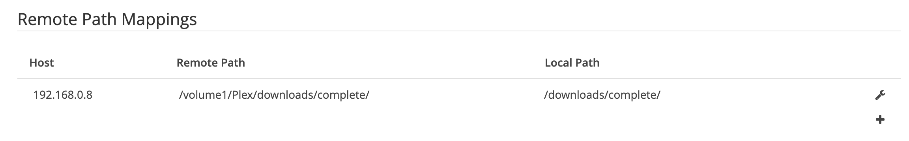

# Personal Instructions

## Set up VPN on server

[Instructions](https://www.synology.com/en-us/knowledgebase/DSM/help/DSM/AdminCenter/connection_network_vpnclient)

## Install Transmission on NAS

1. Set up `complete` folder
1. Set up `tmp` folder
1. Set up `torrent-blackhole` folder
1. enable stop seeding

## Create NTFS folder on NAS

[Instructions](https://www.synology.com/en-global/knowledgebase/DSM/tutorial/File_Sharing/How_to_access_files_on_Synology_NAS_within_the_local_network_NFS)

## Mount NTFS file

Add in `/etc/fstab`

```
192.168.0.8:/volume1/Plex /home/pi/Plex nfs rw,hard,intr,rsize=8192,wsize=8192,timeo=14 0 0
```

Re mount

```
sudo mount -a
```

(doesn't work when pi restart need to investigate)

## Jackett indexers

1. 1337x
1. cpasbien
1. RARBG
1. The Pirate Bay
1. LimeTorrents
1. Torrent9
1. Torrentz2

## Sonarr

### Enable Completed Download Handling `Remove`

### Add Remote Path Mappings in Download Client settings



More infos:

https://forums.sonarr.tv/t/sonaar-not-moving-completed-downloads-to-tv-folder/13519/8

https://github.com/Sonarr/Sonarr/wiki/Completed-Download-Handling

## TODO

1. Sonarr database is locked
1. Next time rename `Plex` folder to `htpc`
1. Next time rename transmission watch folder to `watch` instead of `torrent-blackhole`
1. for `fstab` when diff with `auto,_netdev,nofaill`
